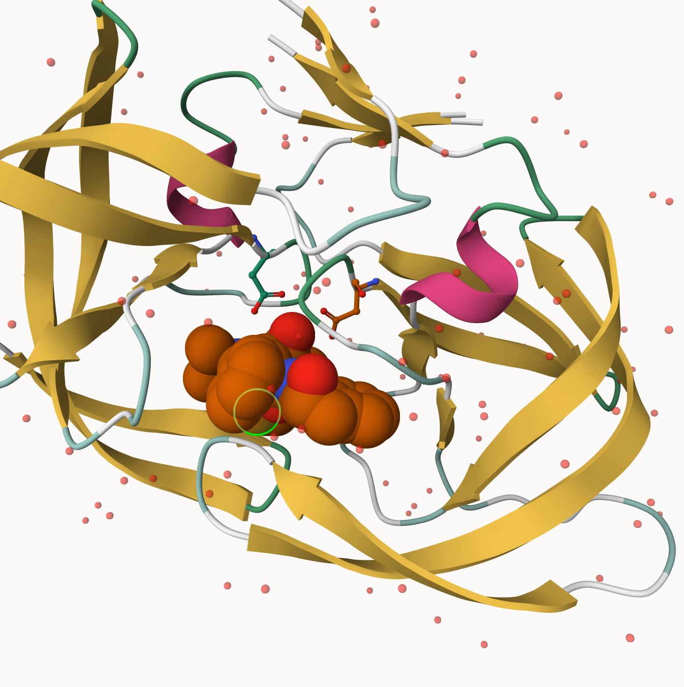
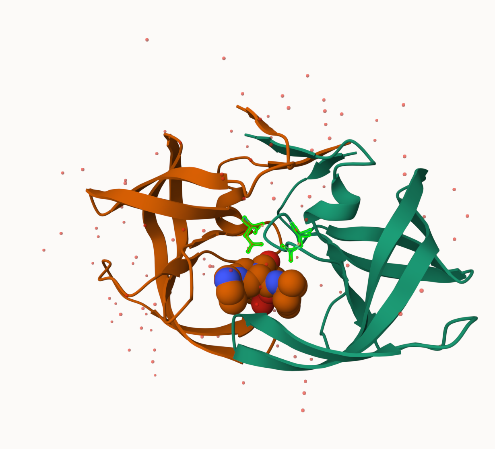

```{r}
# download csv file
read.csv("pdb_stats.csv")
```

> **Q1. What percentage of structures in the PDB are solved by X-Ray and Electron Microscopy?**

> **A1. The percentage of structures solved by X-Ray Microscopy are 80.95%. The percentage of structures solved by EM are 12.84%.**

Total: 249018 X-Ray Total: 201582 EM Total: 31970

> **Q2. What proportion of structures in the PDB are protein?**

> **A2. The proportion of structures that are protein are 97.91%.**

243818 / 249018 = 97.91%

> **Q3. Type HIV in the PDB website search box on the home page and determine how many HIV-1 protease structures are in the current PDB?**

> **A3. There are 881 HIV-1 protease structures in the current PDB.**

# 3. Visualizaing the HIV-1 protease structure



> **Q4. Water molecules normally have 3 atoms. Why do we see just one atom per water molecule in this structure?**

> **A4. We only see one atom, mainly oxygen, per water molecule, because it contains much more electrons than hydrogen. Therefore, oxygen shows up much more clearer than hydrogen, as the software tracks by electron density.**

> **Q5. There is a critical “conserved” water molecule in the binding site. Can you identify this water molecule? What residue number does this water molecule have?**

> **A5. Yes, this water molecule has a residue number of HOH308. It is situated in the middle of the polymer and the two HIV-1 protease chains.**

> **Q6. Generate and save a figure clearly showing the two distinct chains of HIV-protease along with the ligand. You might also consider showing the catalytic residues ASP 25 in each chain and the critical water (we recommend “Ball & Stick” for these side-chains). Add this figure to your Quarto document.**



# 4. Introduction to Bio3D in R

```{r}
# load bio3d
library(bio3d)

# read pdb file
pdb <- read.pdb("1hsg")
pdb
```

> **Q7. How many amino acid residues are there in this pdb object?**

> **A7. There are 198 amino acid residues**

> **Q8. Name one of the two non-protein residues.**

> **A8. One of the two non-protein residues is water (HOH).**

> **Q9. How many protein chains are in this structure?**

> **A9. There are 2 chains in this structure.**

```{r}
# find attributes of the pdb file
attributes(pdb)
```

```{r}
# access the atom attribute
head(pdb$atom)
```

```{r}
# load packages
library(bio3dview)
library(NGLVieweR)

# generate a NGL structure overview of bio3d pdb
view.pdb(pdb) |>
  setSpin()
```

```{r}
# Select the important ASP 25 residue
sele <- atom.select(pdb, resno=25)

# and highlight them in spacefill representation
view.pdb(pdb, cols=c("navy","teal"), 
         highlight = sele,
         highlight.style = "spacefill") |>
  setRock()
```

```{r}
# read adk (Adenylate Kinase) file
adk <- read.pdb("6s36")
adk
```

```{r}
# Perform flexiblity prediction
m <- nma(adk)
```

```{r}
# create plot
plot(m)
```

```{r}
# view display using view.nma() function
view.nma(m, pdb=adk)
```

# 5. Comparative structure analysis of Adenylate Kinase

> **Q10. Which of the packages above is found only on BioConductor and not CRAN?**

> **A10. The msa package is found only on BioConducter, due to the BiocManager::install() function.**

> **Q11. Which of the above packages is not found on BioConductor or CRAN?**

> **A11. The bioboot/bio3dview package is not found on BioConductor or CRAN, and needs to be installed using the devtools::install_github() function.**

> **Q12. True or False? Functions from the pak package can be used to install packages from GitHub and BitBucket?**

> **A12. True.**

```{r}
# load package
library(bio3d)

# view query sequence for chain A
aa <- get.seq("1ake_A")

aa
```

> **Q13. How many amino acids are in this sequence, i.e. how long is this sequence?**

> **A13. There are 214 amino acids in this sequence.**

```{r}
# use sequence as a query to find similar sequences on PDB
hits <- NULL
hits$pdb.id <- c('1AKE_A','6S36_A','6RZE_A','3HPR_A','1E4V_A','5EJE_A','1E4Y_A','3X2S_A','6HAP_A','6HAM_A','4K46_A','3GMT_A','4PZL_A')
```

```{r}
# Download releated PDB files
files <- get.pdb(hits$pdb.id, path="pdbs", split=TRUE, gzip=TRUE)
```

```{r}
# Align releated PDBs
pdbs <- pdbaln(files, fit = TRUE, exefile="msa")
```

```{r}
# view results with bio3dview 
library(bio3dview)

view.pdbs(pdbs)
```

```{r}
# Vector containing PDB database codes
ids <- basename.pdb(pdbs$id)

anno <- pdb.annotate(ids)
unique(anno$source)

```

```{r}
# view annotation data
anno
```

```{r}
# Perform PCA
pc.xray <- pca(pdbs)
plot(pc.xray)
```

```{r}
# Calculate RMSD
rd <- rmsd(pdbs)

# Structure-based clustering
hc.rd <- hclust(dist(rd))
grps.rd <- cutree(hc.rd, k=3)

plot(pc.xray, 1:2, col="grey50", bg=grps.rd, pch=21, cex=1)
```

```{r}
# Visualize first principal component
pc1 <- mktrj(pc.xray, pc=1, file="pc_1.pdb")
```

```{r}
# view results
view.pca(pc.xray)
```

```{r}
#Plotting results with ggplot2
library(ggplot2)
library(ggrepel)

df <- data.frame(PC1=pc.xray$z[,1], 
                 PC2=pc.xray$z[,2], 
                 col=as.factor(grps.rd),
                 ids=ids)

p <- ggplot(df) + 
  aes(PC1, PC2, col=col, label=ids) +
  geom_point(size=2) +
  geom_text_repel(max.overlaps = 20) +
  theme(legend.position = "none")
p
```
