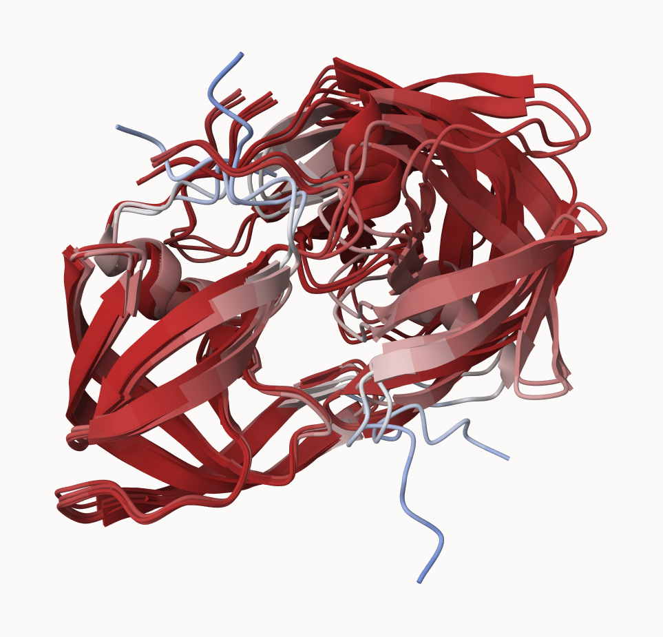
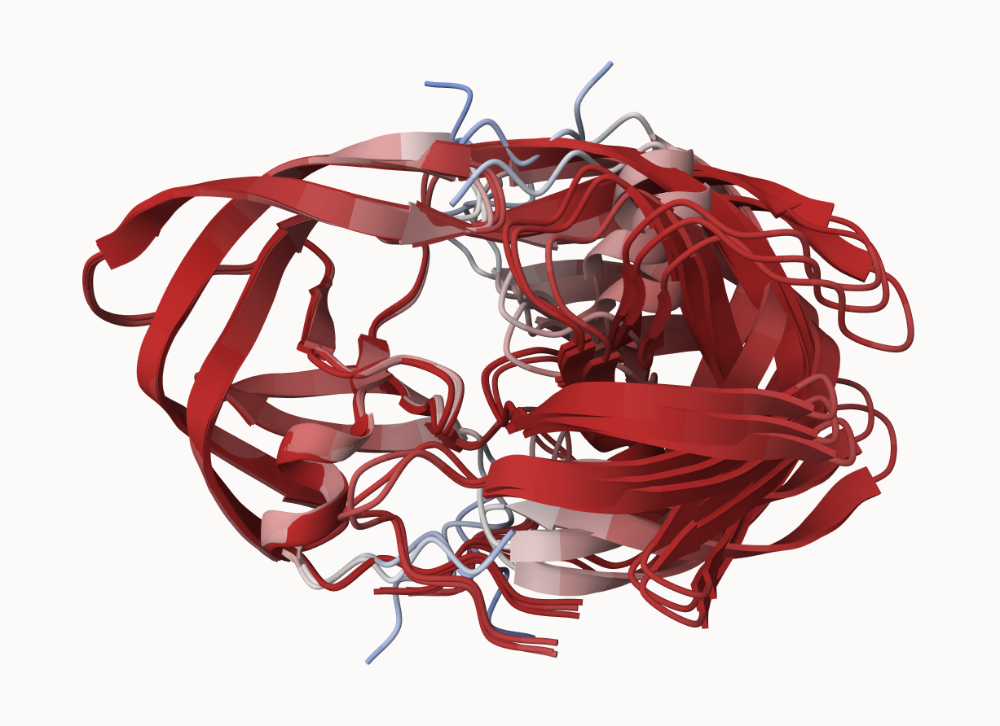
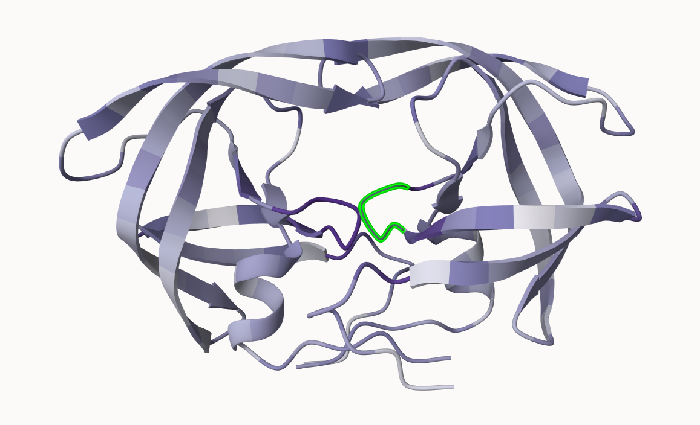

Figure 18:



# 8. Custom analysis of resulting models

```{r}
# Change this for YOUR results dir name
results_dir <- "proteinsearch_23119" 
```

```{r}
# File names for all PDB models
pdb_files <- list.files(path=results_dir,
                        pattern="*.pdb",
                        full.names = TRUE)

# Print our PDB file names
basename(pdb_files)
```

```{r}
# load bio3d
library(bio3d)

# Read all data from Models 
#  and superpose/fit coords
pdbs <- pdbaln(pdb_files, fit=TRUE, exefile="msa")
```

```{r}
# quick overview of model sequences
pdbs
```

```{r}
# use rmsd() function to calculate RMSD between all paris models
rd <- rmsd(pdbs, fit=T)
```

```{r}
range(rd)
```

```{r}
# load pheatmap
library(pheatmap)
# draw a heatmap of RMSD matrix values
colnames(rd) <- paste0("m",1:5)
rownames(rd) <- paste0("m",1:5)
pheatmap(rd)
```

```{r}
# Read a reference PDB structure
pdb <- read.pdb("1hsg")
```

```{r}
# plot pLDDT values across all models
plotb3(pdbs$b[1,], typ="l", lwd=2, sse=pdb)
points(pdbs$b[2,], typ="l", col="red")
points(pdbs$b[3,], typ="l", col="blue")
points(pdbs$b[4,], typ="l", col="darkgreen")
points(pdbs$b[5,], typ="l", col="orange")
abline(v=100, col="gray")
```

```{r}
# find most consistent "rigid core" common across all models
core <- core.find(pdbs)
```

```{r}
# use the identified core atom positions as a basis for more suitable superposition
core.inds <- print(core, vol=0.5)
```

```{r}
# add superposed coordinates to corefit_structures file
xyz <- pdbfit(pdbs, core.inds, outpath="corefit_structures")
```

Figure 19:



```{r}
# examine RMSF between positions of the structure
rf <- rmsf(xyz)

plotb3(rf, sse=pdb)
abline(v=100, col="gray", ylab="RMSF")
```

## Predicted Alignment Error for domains

```{r}
# load jsonlite
library(jsonlite)

# Listing of all PAE JSON files
pae_files <- list.files(path=results_dir,
                        pattern=".*model.*\\.json",
                        full.names = TRUE)
```

```{r}
# read the 1st and 5th files
pae1 <- read_json(pae_files[1],simplifyVector = TRUE)
pae5 <- read_json(pae_files[5],simplifyVector = TRUE)

attributes(pae1)
```

```{r}
# Per-residue pLDDT scores 
#  same as B-factor of PDB..
head(pae1$plddt) 
```

```{r}
# find maximum PAE values for model 1
pae1$max_pae
```

```{r}
# find maximum PAE values for model 5
pae5$max_pae
```

```{r}
# plot the PAE scores of model 1 using Bio3D
plot.dmat(pae1$pae, 
          xlab="Residue Position (i)",
          ylab="Residue Position (j)")
```

```{r}
# plot the PAE scores of model 5 using Bio3D
plot.dmat(pae5$pae, 
          xlab="Residue Position (i)",
          ylab="Residue Position (j)",
          grid.col = "black",
          zlim=c(0,30))
```

```{r}
# plot PAE scores of model 1 using same data range as model 5 plot
plot.dmat(pae1$pae, 
          xlab="Residue Position (i)",
          ylab="Residue Position (j)",
          grid.col = "black",
          zlim=c(0,30))
```

## Residue conservation from alignment file

```{r}
# find file ending in .a3m
aln_file <- list.files(path=results_dir,
                       pattern=".a3m$",
                        full.names = TRUE)
aln_file
```

```{r}
# load sequence into R
aln <- read.fasta(aln_file[1], to.upper = TRUE)
```

```{r}
# find number of sequences in alignment
dim(aln$ali)
```

```{r}
# score residue conservation in alignement using conserv() function
sim <- conserv(aln)
```

```{r}
# create conservation plot
plotb3(sim[1:99], sse=trim.pdb(pdb, chain="A"),
       ylab="Conservation Score")
```

```{r}
# generate a consensus sequence with high cutoff value
con <- consensus(aln, cutoff = 0.9)
con$seq
```

```{r}
# map conservation score to Occupancy score of PDB file for viewing in Mol*
m1.pdb <- read.pdb(pdb_files[1])
occ <- vec2resno(c(sim[1:99], sim[1:99]), m1.pdb$atom$resno)
write.pdb(m1.pdb, o=occ, file="m1_conserv.pdb")
```

Figure 20:


