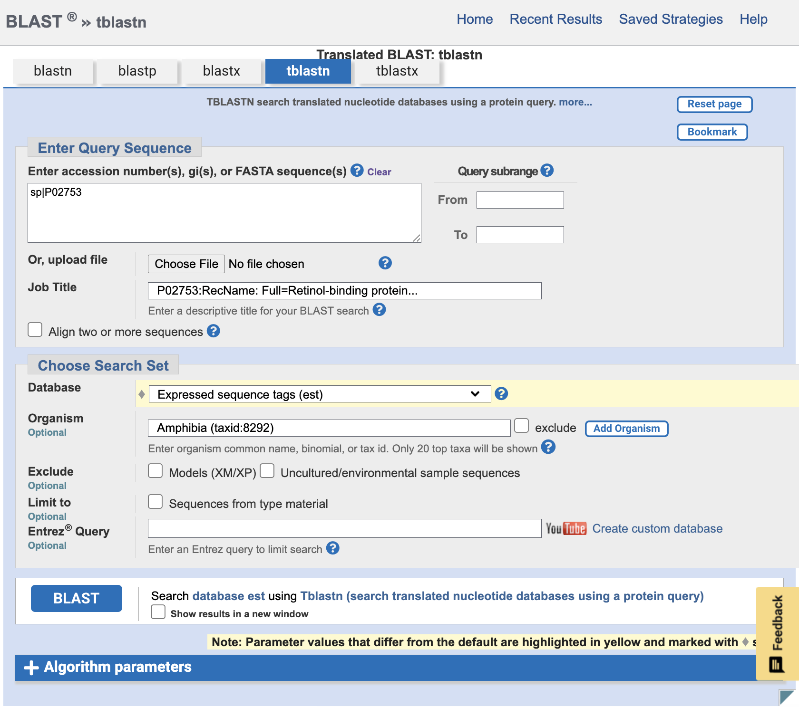
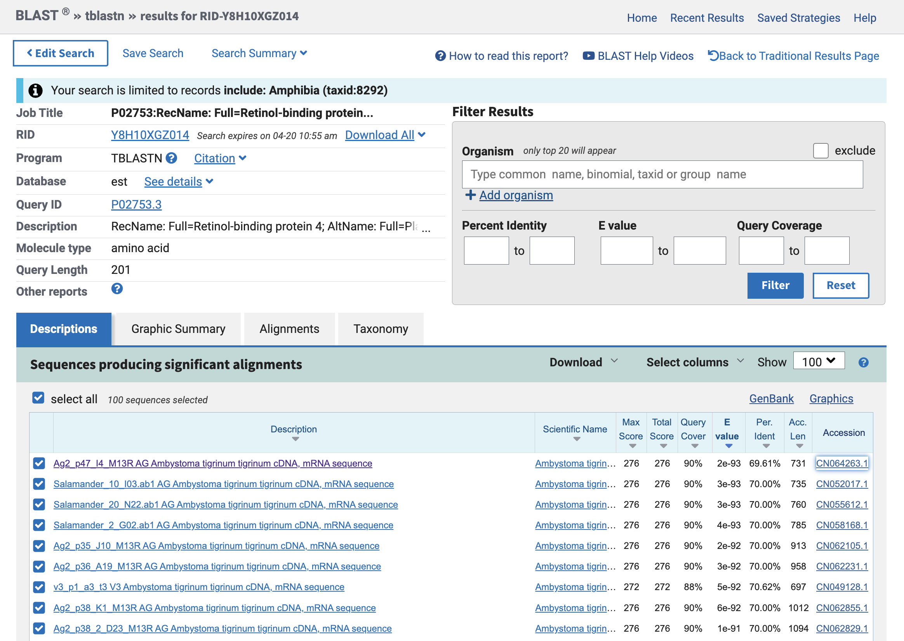
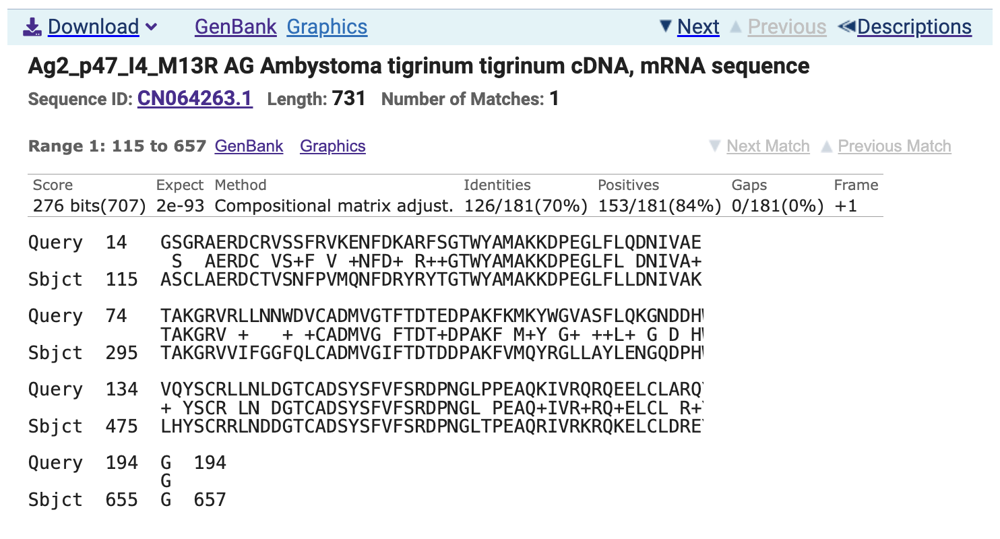
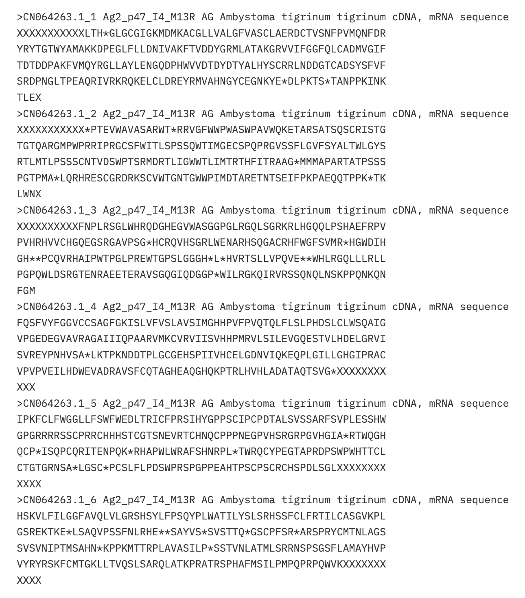
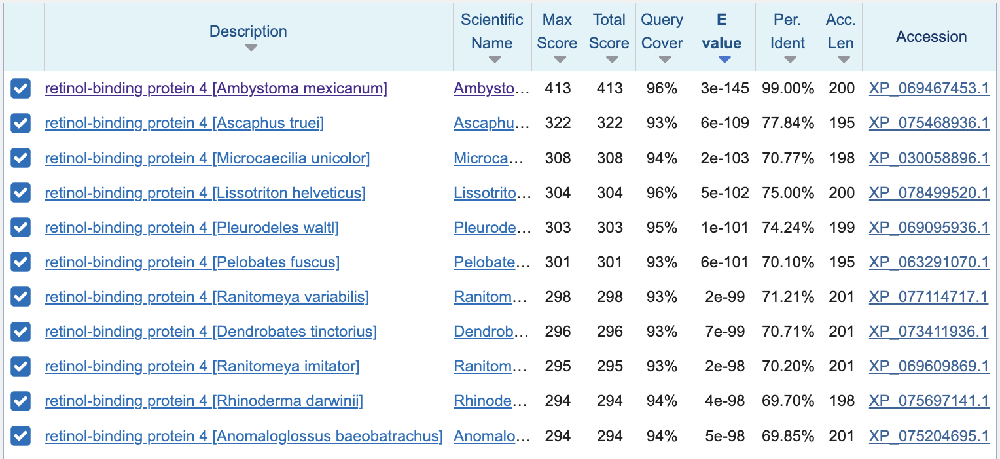
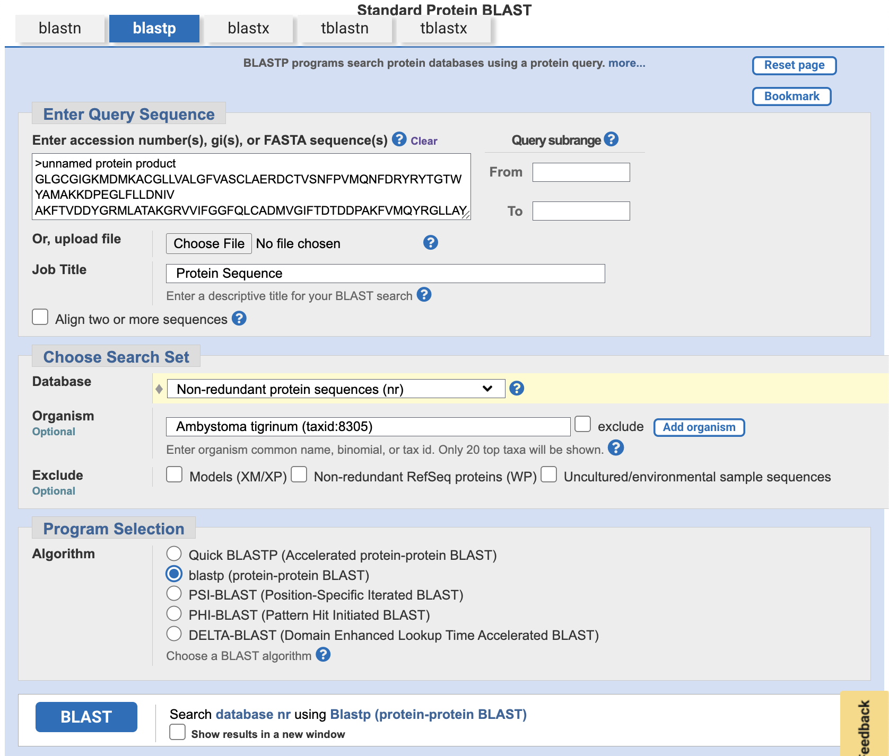
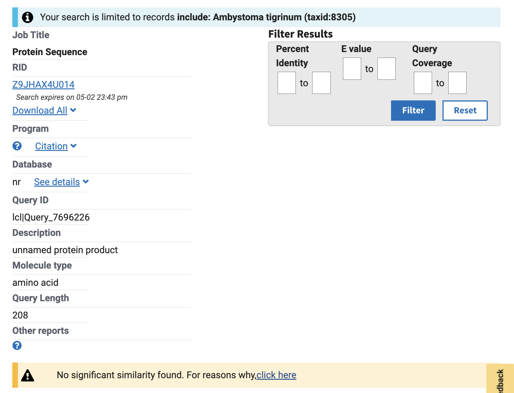

## Q1.

Name: RBP4 protein

Species: Homo sapiens (human)

Accession Number: P02753

Known Function: It carries retinol (vitamin A alcohol) from liver stores, through blood, and into peripheral tissues. It causes vitamin A deficiency if it is blocked and unable to supply retinol to epidermal cells.

## Q2.

Blast Method: TBLASTN

Database: Expressed Sequence Tags (est)

Organism: Amphibia (taxid:8292)

Chosen match: Accession CN064263.1, a 731 base pair clone from Ambystoma tigrinum. First match of screenshot below.

## Q3.

A. tigrinum protein GLGCGIGKMDMKACGLLVALGFVASCLAERDCTVSNFPVMQNFDRYRYTGTWYAMAKKDPEGLFLLDNIVAKFTVDDYGRMLATAKGRVVIFGGFQLCADMVGIFTDTDDPAKFVMQYRGLLAYLENGQDPHWVVDTDYDTYALHYSCRRLNDDGTCADSYSFVFSRDPNGLTPEAQRIVRKRQKELCLDREYRMVAHNGYCEGNKYE

Name: Ambystoma protein

Species: Ambystoma tigrinum (tiger salamander)

Eukaryota; Metazoa; Chordata; Craniata;Vertebrata; Euteleostomi;Amphibia; Batrachia; Caudata; Salamandroidea; Ambystomatidae; Ambystoma

## Q4.

A BLASTP search against NR database yielded a top hit result to a protein from Ambystoma mexicanum (axolotl).

The top result is to a protein from Ambystoma mexicanum (axolotl).

In order to confirm my protein was novel, I blasted against my species (Ambystoma tigrinum) only. I received no matches.

